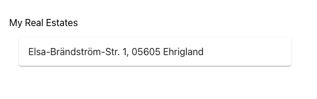
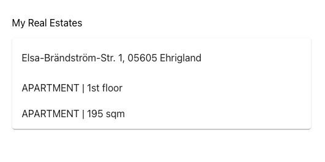

# Getting Started with Create React App

This project was bootstrapped with [Create React App](https://github.com/facebook/create-react-app).

## Getting Started

This project uses [msw](https://mswjs.io/) to mock network calls on local machine. First time you run this project,
please run:

### `npx msw init public --save`

Then you should download the dependencies with the following command:

### `npm install`

Then you can run the project locally with:

### `npm start`

Open [http://localhost:3000](http://localhost:3000) to view it in the browser.

## Task

Create a simple React application that fetches real estate data (see [mock data](src/mocks/handlers.ts)) and displays it
in an accordion (see [mui Accordion component](https://mui.com/material-ui/react-accordion/)).

The accordion should have the following structure:

- The accordion should have a header with the address.
- The accordion details should be real estates grouped under the same address, it should follow the format
  of `Apartment | 195 sqm | 2nd floor `
- If optional field is not available, it should not be displayed.

Example of collapsed accordion:

.

Example of expanded accordion:

.